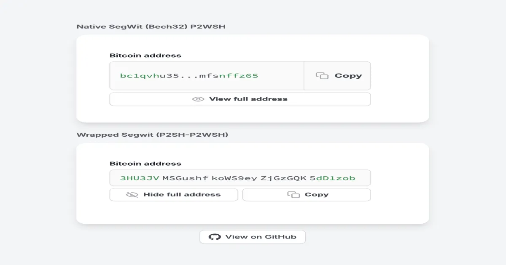
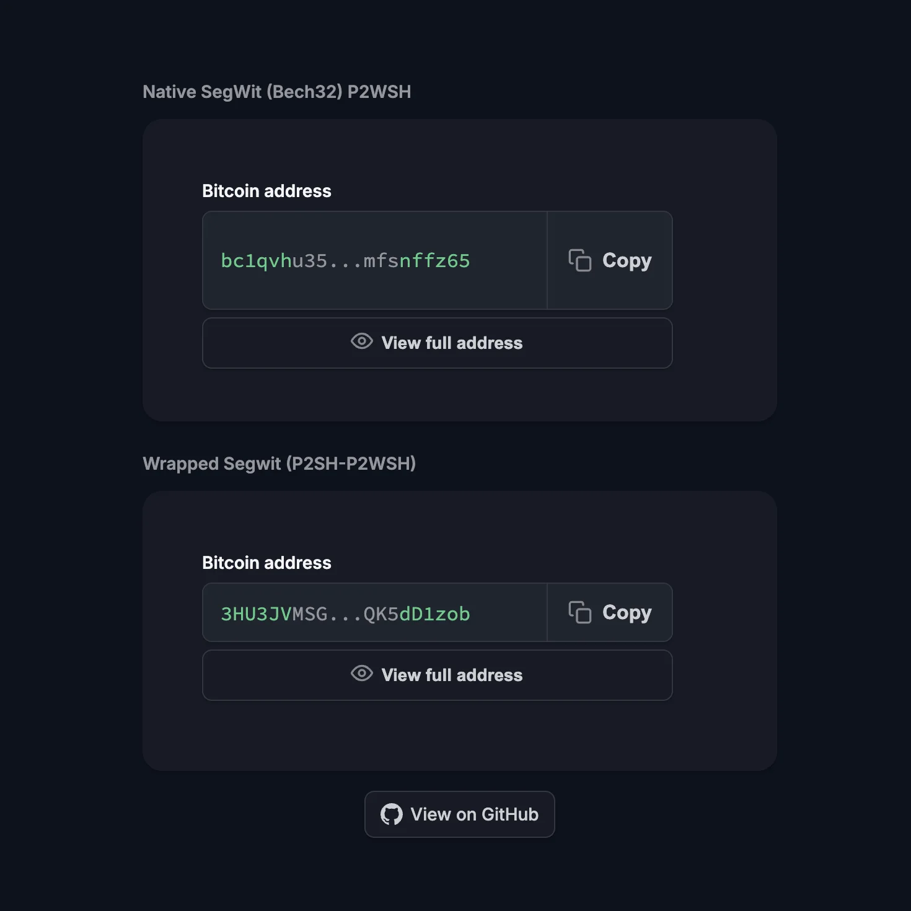

# Beautiful Bitcoin Address Component

A production-ready web component for displaying bitcoin addresses with expand/collapse reveal, copy-to-clipboard, and light/dark theme support. Zero dependencies, no build step, with TypeScript types and a typed React wrapper included. Designed for wallet interfaces, payment flows, and educational resources.

**[Live Demo](https://matthewball.me/bitcoin-address-component/)** | **[Bitcoin Design Guide Reference](https://bitcoin.design/guide/glossary/address/)**

## Preview

<p align="center">
  
  
</p>

## Quick Start

### Script tag

Add the script to your page and use the `<bitcoin-address>` custom element:

```html
<script src="https://matthewball.me/bitcoin-address-component/bitcoin-address.js"></script>

<bitcoin-address address="bc1qvhu3557twysq2ldn6dut6rmaj3qk04p60h9l79wk4lzgy0ca8mfsnffz65"></bitcoin-address>
```

That's it. The component renders with full interactivity — no build step, no framework, no configuration required.

### npm / bundlers

Install straight from GitHub:

```bash
npm install github:matthewrball/beautiful-bitcoin-address-component
```

Import once for the side effect of registering the element (TypeScript types included):

```js
import 'beautiful-bitcoin-address-component';
```

### React / Next.js

A typed React wrapper is included at the `/react` entry point. It registers the element, forwards props as attributes, and converts the custom events into callback props:

```tsx
import { BitcoinAddress } from 'beautiful-bitcoin-address-component/react';

function DepositAddress({ address }: { address: string }) {
  const handleCopy = ({ address, success }) => {
    if (success) toast('Address copied to clipboard');
  };

  return (
    <BitcoinAddress
      address={address}
      label="Deposit address"
      onCopy={handleCopy}
    />
  );
}
```

| Prop | Type | Description |
|------|------|-------------|
| `address` | `string` | *(required)* The full bitcoin address |
| `format` | `'auto' \| 'bech32' \| 'p2sh' \| 'taproot' \| 'legacy'` | Address format (default `auto`) |
| `label` | `string` | Label text (default `Bitcoin address`) |
| `theme` | `'auto' \| 'light' \| 'dark'` | Color theme (default `auto`) |
| `onCopy` | `(detail: { address, success }) => void` | Copy button callback |
| `onToggle` | `(detail: { expanded }) => void` | Expand/collapse callback |

`className`, `style`, `id`, and other standard HTML attributes pass through to the host element. The wrapper is marked `'use client'`, so it drops into a Next.js App Router project without extra configuration. On the server it renders the bare `<bitcoin-address>` tag, which upgrades on the client — no hydration mismatch.

## Supported Address Formats

The component auto-detects the address format from the prefix:

| Format | Prefix | Example | Lines |
|--------|--------|---------|-------|
| Native SegWit (Bech32) | `bc1q` | `bc1qvhu3557tw...nffz65` | Multi-line |
| Taproot | `bc1p` | `bc1p5cyxnuxm...57ctq` | Multi-line |
| Wrapped SegWit (P2SH) | `3` | `3HU3JVMSGushf...dD1zob` | Single-line |
| Legacy (P2PKH) | `1` | `1A1zP1eP5QGef...4SsRd` | Single-line |

Addresses longer than 40 characters automatically use a multi-line expanded view. Shorter addresses expand inline.

## API

```html
<bitcoin-address
  address="bc1qvhu3557tw..."
  format="auto"
  label="Bitcoin address"
  theme="auto"
></bitcoin-address>
```

| Attribute | Default | Description |
|-----------|---------|-------------|
| `address` | *required* | The full bitcoin address string |
| `format` | `auto` | Address format: `bech32`, `p2sh`, `taproot`, `legacy`, or `auto` (detected from prefix) |
| `label` | `Bitcoin address` | Label text displayed above the address field |
| `theme` | `auto` | Color theme: `light`, `dark`, or `auto` (follows host page or `prefers-color-scheme`) |

All attributes are also available as reflected JavaScript properties (`el.address = '...'`), so the element works with frameworks that assign properties instead of attributes. The resolved format is exposed as a readonly `detectedFormat` property and reflected to a `data-format` attribute on the host element — a styling hook for format-specific CSS.

Attribute values are HTML-escaped before rendering, so user-supplied labels and addresses are safe to pass straight through.

## Features

- **Expand/collapse** — Truncated address with prefix and suffix highlighting. Click to reveal the full address with a smooth clip-path animation.
- **Copy to clipboard** — Inline copy button with animated icon feedback (copy to checkmark). Falls back to `execCommand` for older browsers.
- **Dark mode** — Automatic theme detection via `prefers-color-scheme`, host page `.dark` class, or explicit `theme` attribute.
- **Shadow DOM** — Fully encapsulated styles. No CSS leaks into or out of your page.
- **Accessible** — ARIA labels, keyboard navigation, `prefers-reduced-motion` support.
- **Zero dependencies** — Single vanilla JS file (~15KB). No framework required.
- **Mobile-ready** — Responsive layout, touch-friendly tap targets (44px minimum), no pinch-zoom interference.

## Events

The component dispatches custom events for integration with your application:

```javascript
document.querySelector('bitcoin-address').addEventListener('bitcoin-address:copy', function(e) {
  console.log('Copied:', e.detail.address, 'Success:', e.detail.success);
});

document.querySelector('bitcoin-address').addEventListener('bitcoin-address:toggle', function(e) {
  console.log('Expanded:', e.detail.expanded);
});
```

| Event | Detail | Description |
|-------|--------|-------------|
| `bitcoin-address:copy` | `{ address, success }` | Fired when the copy button is clicked |
| `bitcoin-address:toggle` | `{ expanded }` | Fired when the address is expanded or collapsed |

## Theming

### Automatic

By default (`theme="auto"`), the component follows your page's color scheme:

1. Checks for `.dark` or `.theme--dark` class on `<html>`
2. Falls back to `prefers-color-scheme: dark` media query
3. Updates reactively when the host page toggles dark mode

### Custom Colors

Override design tokens with CSS custom properties on the `<bitcoin-address>` element:

```css
bitcoin-address {
  --btc-font-mono: 'Source Code Pro', monospace;
  --btc-success: #079455;
  --btc-text-primary: #181d27;
  --btc-text-secondary: #414651;
  --btc-text-tertiary: #535862;
  --btc-border: #d5d7da;
  --btc-bg-subtle: #fafafa;
  --btc-bg-secondary: #ffffff;
  --btc-bg-hover: #f9fafb;
  --btc-icon: #a4a7ae;
  --btc-icon-success: #079455;
}
```

These custom properties pierce the Shadow DOM boundary, giving you full control over the component's appearance.

## Using with Jekyll (Bitcoin Design Guide)

A ready-made Jekyll include is provided for the [Bitcoin Design Guide](https://bitcoin.design/guide/):

1. Copy `bitcoin-address.js` to your Jekyll site's `/js/` directory
2. Copy `jekyll/_includes/bitcoin-address.html` to your `_includes/` directory
3. Use in any markdown page:

```liquid

```

The include handles lazy-loading the JavaScript (loaded once, even with multiple instances) and provides a `<noscript>` fallback showing the raw address.

## Local Development

No build step required. Open the demo page directly:

```bash
# Clone the repo
git clone https://github.com/matthewrball/beautiful-bitcoin-address-component.git
cd beautiful-bitcoin-address-component

# Serve locally
python3 -m http.server 8000

# Open http://localhost:8000
```

Run the test suite (Node 22+, uses the built-in test runner with jsdom):

```bash
npm install
npm test
```

## File Structure

```
beautiful-bitcoin-address-component/
  bitcoin-address.js           Web Component (self-contained, ~15KB)
  bitcoin-address.d.ts         TypeScript types for the element and its events
  react.js                     React wrapper ('use client', no build step)
  react.d.ts                   TypeScript types for the React wrapper
  index.html                   Demo page (uses the component)
  test/                        Unit tests (node --test + jsdom)
  jekyll/
    _includes/
      bitcoin-address.html     Jekyll include for bitcoin.design
  og-image.webp                Social preview image
  .htaccess                    Cache headers
  LICENSE                      MIT
```

## Design Principles

This component follows the [Bitcoin Design Guide's](https://bitcoin.design/guide/glossary/address/) address display best practices:

- **Prefix and suffix highlighting** — The first and last 6 characters are highlighted in green, making it easy to visually verify an address at a glance.
- **Grouped characters** — The expanded address is split into groups of 7 for readability, similar to how phone numbers and credit cards are formatted.
- **Progressive disclosure** — The truncated view shows just enough to identify the address. The full address is revealed on demand, reducing visual noise.
- **Copy confirmation** — Animated icon feedback (copy to checkmark) gives clear confirmation that the address was copied, reducing the anxiety of handling sensitive financial data.

### Motion design

All animations in this component follow the [design-motion-principles](https://github.com/kylezantos/design-motion-principles) framework, drawing from techniques by Emil Kowalski, Jakub Krehel, and Jhey Tompkins. This includes spring-based easing curves for expand/collapse transitions, expo-out timing for copy feedback, and clip-path reveals for the full address. Every animation respects `prefers-reduced-motion` and uses durations tuned to feel responsive without being distracting.

## Browser Support

Chrome 80+, Firefox 75+, Safari 13+, Edge 80+. The component uses `customElements.define` (supported in all modern browsers) and `navigator.clipboard` with `execCommand('copy')` fallback.

## License

MIT. Designed by [Matthew Ball](https://matthewball.me).
